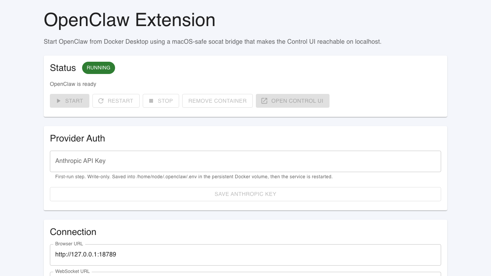

# OpenClaw Docker Desktop Extension

Run OpenClaw from Docker Desktop on macOS with a more isolated, localhost-only container setup.

## 60-second quick start

This repo packages OpenClaw as a Docker Desktop extension for macOS. It builds two local images, installs the extension into Docker Desktop, and gives you start/stop controls plus a write-only Anthropic API key flow.

```bash
make install-dev
```

Then:

1. Open the `OpenClaw` extension in Docker Desktop.
2. Click `Start OpenClaw`.
3. If you plan to use Anthropic-backed sessions, paste an Anthropic API key into `Provider Auth` and save.
4. Wait for the service status to show `OpenClaw is ready`.
5. Click `Open Control UI` and connect with:
   - Browser URL: `http://127.0.0.1:18789`
   - WebSocket URL: `ws://127.0.0.1:18789`

If Docker Desktop blocks local extensions, enable local or non-Marketplace extension installs first.

## Fast command guide

Use these commands depending on where you are in the flow:

- `make install-dev`: build both local images and install the extension into Docker Desktop
- `make update-extension`: rebuild both local images and refresh an existing local install
- `make uninstall`: remove the extension from Docker Desktop
- `make capture-readme-screenshot`: rebuild the demo UI and refresh the checked-in README screenshot

## Release-image path

Tagged releases now publish both images to GHCR through GitHub Actions:

- extension image: `ghcr.io/jcowhigjr/openclaw-docker-desktop-extension:<tag>`
- runtime image: `ghcr.io/jcowhigjr/openclaw-docker-desktop-extension-runtime:<tag>`

Release builds of the extension UI default the runtime image field to the matching GHCR runtime tag. Local development still defaults to `openclaw-docker-extension-runtime:dev`.

## What the extension looks like



The screenshot is generated from the real extension UI running in browser demo mode, so it can be refreshed without Docker Desktop by running `make capture-readme-screenshot`.

## What this project is

OpenClaw normally expects its gateway listener to work from inside the container. On Docker Desktop for macOS, that can leave the Control UI unreachable from the host even when the process is healthy.

This extension works around that by running OpenClaw inside a small wrapper image that includes `socat`, then publishing a localhost bridge that behaves like a normal host-facing service.

Use this repo if you want:

- a Docker Desktop-native way to try OpenClaw on macOS
- localhost-only exposure instead of a broader host bind
- an easier-to-clean-up local install path with state in a named Docker volume

Do not use this repo expecting a strong security boundary. It is a more isolated local setup, not a perfect one.

## Before you install

This is the current tested path:

- Docker Desktop on macOS
- Apple Silicon
- local image builds for both the runtime wrapper and the extension image

Current constraints:

- Intel Mac support is not complete yet.
- The extension has been tested primarily on macOS with Docker Desktop.
- The project currently assumes a local build instead of pre-built GHCR images.
- GHCR publishing is wired for tagged releases, but the end-user one-line install flow is not documented as complete yet.

## What the extension does

- Starts and manages an OpenClaw service container from Docker Desktop
- Uses a bundled `socat` bridge so the Control UI is reachable on macOS
- Persists OpenClaw state in a named Docker volume
- Exposes Docker Desktop UI controls for start, stop, restart, and open-in-browser actions
- Surfaces runtime diagnostics in a debug panel inside the extension

## Default runtime

- Runtime image: `openclaw-docker-extension-runtime:dev`
- Host port: `18789`
- Internal bridge port: `18790`
- Named volume: `openclaw-docker-extension-home`
- Service container: `openclaw-docker-extension-service`

## Provider auth

The extension includes a masked, write-only Anthropic API key field.

- The key is written into `/home/node/.openclaw/.env`
- That file lives in the persistent Docker volume `openclaw-docker-extension-home`
- The extension clears the input field after save
- The service restarts after the key is written so OpenClaw reloads the credential

You can install and open the extension before saving a key, but Anthropic-backed sessions will not work until one is stored.

This means the credential survives container restarts and rebuilds, but is removed if you delete the named volume.

## Security and isolation notes

- The wrapper publishes OpenClaw on `127.0.0.1` only.
- State is stored in the named Docker volume `openclaw-docker-extension-home`.
- This is a more isolated local packaging path, not a perfect security boundary.
- This project is not an official Docker or OpenClaw extension.

## Current limitations

- Gateway token autofill is not fully reliable yet. If the token field is blank in the extension UI, open the Control UI and paste the token manually.
- The runtime can spend a short warm-up period in `starting` even after the host health check is already passing.
- Anthropic provider auth currently supports the local `.env` persistence path first. It does not yet manage richer OpenClaw auth-profile workflows in the UI.

## Troubleshooting

- If the extension says `RUNNING` but the browser page does not open, check `http://127.0.0.1:18789/healthz`.
- If the token field is empty, inspect the debug panel in the extension and fetch the token from the service container or volume.
- If local installation fails, confirm Docker Desktop allows local extensions.

## Repository layout

- [metadata.json](./metadata.json): Docker Desktop extension metadata
- [docker-compose.yaml](./docker-compose.yaml): extension service wiring
- [runtime/Dockerfile](./runtime/Dockerfile): local runtime image that bundles `socat`
- [runtime/openclaw-bridge.sh](./runtime/openclaw-bridge.sh): starts OpenClaw and the bridge
- [ui/src/App.tsx](./ui/src/App.tsx): extension dashboard

## Attribution

- OpenClaw upstream project: <https://github.com/openclaw/openclaw>
- Docker Desktop extension structure was informed by the Open WebUI Docker Desktop extension pattern
