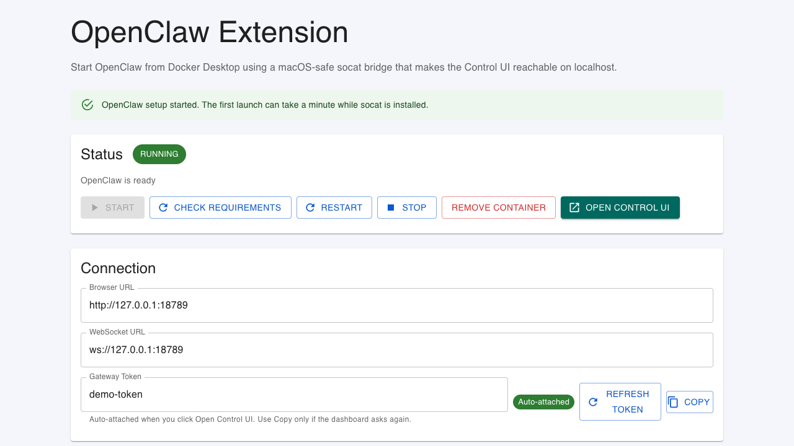

# Shellharbor — Run OpenClaw on your Mac in one click

**Shellharbor** is a Docker Desktop extension that starts, isolates, and manages [OpenClaw](https://github.com/openclaw/openclaw) — your personal, open-source AI assistant — in a hardened, localhost-only container. No terminal required.

- **One-click run** — start, stop, restart, and open the Control UI from a GUI.
- **Isolated by default** — read-only root filesystem, all capabilities dropped, `no-new-privileges`, bound to `127.0.0.1` only.
- **Managed lifecycle** — persistent state, runtime update checks, and guided host-Ollama setup for offline local models.

*Community packaging. Not an official Docker or OpenClaw extension.*

## 60-second quick start

This repo packages OpenClaw as a Docker Desktop extension for macOS. It builds two local images, installs the extension into Docker Desktop, and gives you start/stop/update controls plus a guided local Ollama setup flow.

Project landing page: <https://jcowhigjr.github.io/openclaw-docker-desktop-extension/>

Submission review packet: [docs/submission-readiness.md](docs/submission-readiness.md)

```bash
make install-dev
```

Optional local push guard:

```bash
make install-hooks
```

This installs the repo pre-push hook, which runs `make test-pre-push` before allowing a push.
The pre-push target also runs local security preflights where possible: Gitleaks when installed and `npm audit --audit-level=critical` for the UI package.

Then:

1. Open the `OpenClaw` extension in Docker Desktop.
2. Click `Start OpenClaw`.
3. Wait for the service status to show `OpenClaw is ready`.
4. Choose a first-run provider path in the extension:
   - `Free local (Ollama)`: detect a host Ollama model and apply it as the default, or follow the pull/install guidance when no model is ready yet.
   - `Hosted (Anthropic API key)`: continue with OpenClaw's existing provider auth or `.env` flow.
5. Click `Open Control UI`. The extension opens the canonical localhost Control UI and passes the gateway token through the URL fragment for dashboard bootstrap after a usable provider path is selected.

If Docker Desktop blocks local extensions, enable local or non-Marketplace extension installs first.

## Fast command guide

Use these commands depending on where you are in the flow:

- `make install-dev`: build both local images and install the extension into Docker Desktop
- `make update-extension`: rebuild both local images and refresh an existing local install
- `make verify-release-tag RELEASE_TAG=vX.Y.Z`: maintainer check that the GitHub release exists, the GHCR tags and Docker Hub extension semver tag are public, and the published extension title label stayed validator-safe
- `make verify-release-bundle RELEASE_TAG=vX.Y.Z`: maintainer check that a release extension build points at the matching GHCR runtime image
- `make verify-release-install RELEASE_TAG=vX.Y.Z`: maintainer check that Docker Desktop can install and uninstall the GHCR extension image and Docker Hub Marketplace semver image
- `make publish-release RELEASE_TAG=vX.Y.Z`: maintainer fallback if a tag exists but the GitHub release needs to be repaired manually
- `make ship-release RELEASE_TAG=vX.Y.Z`: maintainer repair path that publishes the GitHub release if needed, verifies release tags, then validates Docker Desktop install/uninstall
- `make install-release RELEASE_TAG=vX.Y.Z`: install a tagged GHCR-published extension image after an anonymous GHCR preflight
- `make update-release RELEASE_TAG=vX.Y.Z`: update an installed GHCR-published extension image after the same preflight
- `make verify-release-channel RELEASE_CHANNEL=stable`: maintainer check that the floating channel tags are publicly readable
- `make verify-release-channel RELEASE_CHANNEL=stable EXPECTED_RELEASE_TAG=vX.Y.Z`: maintainer check that the floating channel still points at the intended release tag
- `make verify-channel-install RELEASE_CHANNEL=stable`: maintainer check that Docker Desktop can install and uninstall the floating channel image
- `make verify-channel-install RELEASE_CHANNEL=stable EXPECTED_RELEASE_TAG=vX.Y.Z`: maintainer check that the installable floating channel also matches the intended release tag
- `make create-smoke-report RELEASE_CHANNEL=stable RELEASE_TAG=vX.Y.Z`: scaffold a timestamped manual smoke-test packet under `docs/exploratory/`, including a best-effort `capture-artifacts.sh` helper
- `make install-channel RELEASE_CHANNEL=stable`: install the current published GHCR channel image with the same preflight
- `make update-channel RELEASE_CHANNEL=stable`: update an installed GHCR channel image with the same preflight
- add `DRY_RUN=1` to `install-release`, `update-release`, or `ship-release` to rehearse the documented release path without mutating Docker Desktop
- `make uninstall`: remove the extension from Docker Desktop
- `make capture-readme-screenshot`: rebuild the demo UI and refresh the checked-in README screenshot

## Release-image path

Tagged releases now publish both images to GHCR through GitHub Actions and create the matching GitHub release automatically:

- extension image: `ghcr.io/jcowhigjr/openclaw-docker-desktop-extension:<tag>`
- runtime image: `ghcr.io/jcowhigjr/openclaw-docker-desktop-extension-runtime:<tag>`
- published architectures: `linux/arm64` and `linux/amd64`

The release workflow also publishes the extension image to Docker Hub for Docker Marketplace validation:

- Marketplace image: `docker.io/jcowhigjr/openclaw-docker-desktop-extension:<semver>`
- required GitHub Actions secrets: `DOCKERHUB_USERNAME` and `DOCKERHUB_TOKEN`

Docker's automated Marketplace submission validates the greatest semver tag on Docker Hub, so the non-`v` semver tag, for example `0.3.4`, must be public before submission.

Release builds of the extension UI default the runtime image field to the matching GHCR runtime tag. Local development still defaults to `openclaw-docker-extension-runtime:dev`.

The publish workflow also promotes both images onto floating channel tags on real tag pushes:

- `stable` for normal release tags such as `v0.2.0`
- `beta` for prerelease tags such as `v0.2.0-rc.1`

That gives end users a one-line extension install path and gives the extension a predictable GHCR runtime channel for update checks without changing the pinned version-tag install path.

When the runtime image points at a published GHCR channel tag such as `stable` or `beta`, the extension can check for a newer runtime image on open and again before launch.

The standalone runtime publish workflow also refreshes `ghcr.io/jcowhigjr/openclaw-docker-desktop-extension-runtime:latest` on a daily schedule and can still be run manually with `workflow_dispatch`. It also publishes the older `ghcr.io/jcowhigjr/openclaw-docker-extension-runtime:latest` alias for existing local installs. That scheduled rebuild is how the wrapper picks up new `ghcr.io/openclaw/openclaw:latest` content when this repo has no file changes, so upstream OpenClaw updates become available after the next scheduled runtime rebuild and GHCR push, not instantly at the moment upstream publishes them.

The current MVP update policies are:

- `Check only`: show an update banner and let the user trigger the update manually
- `Auto-update before launch`: pull the newer runtime image and recreate the service container before `Start`

The update flow preserves the named Docker volume and saved settings. A "what's new" surface is still out of scope for MVP.

Maintainer preflight for a newly published tag:

```bash
make verify-release-tag RELEASE_TAG=vX.Y.Z
```

Local maintainer check before publishing a new tag:

```bash
make verify-release-bundle RELEASE_TAG=vX.Y.Z
```

That build-time check proves the extension bundle is wired to the matching GHCR runtime tag instead of falling back to the local dev runtime image.

That check verifies the requirements for the documented install path and Marketplace submission:

- the GitHub release exists for the tag
- both GHCR image tags exist
- both GHCR packages are public to anonymous users
- the Docker Hub extension semver tag exists for Marketplace validation
- the published extension title label remains validator-safe on GHCR and Docker Hub

If you want the full maintainer handoff in one command after the tag is published:

```bash
make ship-release RELEASE_TAG=vX.Y.Z
```

To rehearse the same maintainer flow without touching GitHub or Docker Desktop state:

```bash
make ship-release RELEASE_TAG=vX.Y.Z DRY_RUN=1
```

If you need to repair a tag after the publish workflow only partially completed:

```bash
make verify-release-bundle RELEASE_TAG=vX.Y.Z
make publish-release RELEASE_TAG=vX.Y.Z
make verify-release-tag RELEASE_TAG=vX.Y.Z
```

`make verify-release-tag` now reads the published extension image config from GHCR, so it can catch release-only metadata drift such as a workflow overriding `org.opencontainers.image.title` after the Dockerfile labels were already correct in `main`.

If the GitHub Actions publish job needs to be re-run for an existing tag, use the `Publish` workflow's manual dispatch and pass `release_tag=vX.Y.Z` so it rebuilds the matching GHCR artifacts instead of publishing the default branch state.

By default that repair path only refreshes the requested versioned tags. Leave `promote_channel=false` when you do not want to move the floating `stable` or `beta` tags. Set `promote_channel=true` only when you are intentionally repairing the current channel pointer for that release.

Before treating the release image as verified for end users, run the Docker Desktop install/uninstall validation:

```bash
make verify-release-install RELEASE_TAG=vX.Y.Z
```

When a tagged release exists, the end-user install path is:

```bash
docker extension install ghcr.io/jcowhigjr/openclaw-docker-desktop-extension:vX.Y.Z
```

The repo-level shortcut checks the published tag first so a missing GHCR release fails early with a clear next step:

```bash
make install-release RELEASE_TAG=vX.Y.Z
```

If you want the latest published channel instead of a pinned tag, use the floating GHCR channel image:

```bash
docker extension install ghcr.io/jcowhigjr/openclaw-docker-desktop-extension:stable
```

Or use the repo shortcut with the same preflight and optional dry-run:

```bash
make install-channel RELEASE_CHANNEL=stable
make install-channel RELEASE_CHANNEL=stable DRY_RUN=1
```

If you are maintaining the floating channel path, verify the anonymous channel tags first:

```bash
make verify-release-channel RELEASE_CHANNEL=stable
make verify-release-channel RELEASE_CHANNEL=stable DRY_RUN=1
make verify-release-channel RELEASE_CHANNEL=stable EXPECTED_RELEASE_TAG=vX.Y.Z
```

To rehearse the same install wrapper without changing Docker Desktop state:

```bash
make install-release RELEASE_TAG=vX.Y.Z DRY_RUN=1
```

To update an existing release install:

```bash
docker extension update ghcr.io/jcowhigjr/openclaw-docker-desktop-extension:vX.Y.Z
```

Or use the repo shortcut with the same preflight and optional dry-run:

```bash
make update-release RELEASE_TAG=vX.Y.Z
make update-release RELEASE_TAG=vX.Y.Z DRY_RUN=1
```

For the floating channel install path:

```bash
make update-channel RELEASE_CHANNEL=stable
make update-channel RELEASE_CHANNEL=stable DRY_RUN=1
```

To validate the Docker Desktop install and uninstall path for the current published channel image:

```bash
make verify-channel-install RELEASE_CHANNEL=stable
make verify-channel-install RELEASE_CHANNEL=stable DRY_RUN=1
```

If there is no tagged release yet, use the local build path in the quick start instead.

## What the extension looks like



The screenshot is generated from the real extension UI running in browser demo mode, so it can be refreshed without Docker Desktop by running `make capture-readme-screenshot`.

## What this project is

OpenClaw normally expects its gateway listener to work from inside the container. On Docker Desktop for macOS, that can leave the Control UI unreachable from the host even when the process is healthy.

This extension works around that by running OpenClaw inside a small wrapper image that includes `socat`, then publishing a localhost bridge that behaves like a normal host-facing service.

Use this repo if you want:

- a Docker Desktop-native way to try OpenClaw on macOS
- localhost-only exposure instead of a broader host bind
- an easier-to-clean-up local install path with state in a named Docker volume

Do not use this repo expecting a strong security boundary. It is a more isolated local setup, not a perfect one.

## Before you install

This is the current tested path:

- Docker Desktop on macOS
- Apple Silicon
- local image builds for both the runtime wrapper and the extension image

Current constraints:

- Intel Mac support is not complete yet.
- On unsupported Docker architectures, the extension now stops before container start and shows a clear error instead of blindly trying `linux/arm64`.
- The extension has been tested primarily on macOS with Docker Desktop.
- The direct GHCR install path depends on a tagged release being published first.
- Until a tagged release exists, the supported install path is still the local build flow.

## What the extension does

- Starts and manages an OpenClaw service container from Docker Desktop
- Uses a bundled `socat` bridge so the Control UI is reachable on macOS
- Persists OpenClaw state in a named Docker volume
- Starts the service container with a read-only root filesystem, `tmpfs` at `/tmp`, `--cap-drop=ALL`, `--security-opt no-new-privileges`, and `--ulimit nofile=1024:1024`
- Exposes Docker Desktop UI controls for start, stop, restart, and open-in-browser actions
- Performs automated vulnerability scanning (Trivy) during the GHCR publish workflow
- Can check published GHCR channel images for runtime updates and optionally apply them before launch
- Surfaces runtime diagnostics in a debug panel inside the extension

## Default runtime

- Runtime image: `openclaw-docker-extension-runtime:dev`
- Host port: `18789`
- Internal bridge port: `18790`
- Named volume: `openclaw-docker-extension-home`
- Service container: `openclaw-docker-extension-service`

## Provider auth and `.env` loading

OpenClaw owns provider credential loading. The wrapper starts the upstream gateway through `docker-entrypoint.sh node openclaw.mjs gateway --allow-unconfigured`; it does not source `.env` itself.

Upstream OpenClaw reads environment variables from the parent process plus these files:

- `.env` from the current working directory when present
- `~/.openclaw/.env`, which maps to `/home/node/.openclaw/.env` in this container

Those files do not override environment variables that already exist in the process. In this extension, `/home/node/.openclaw/.env` lives in the persistent Docker volume `openclaw-docker-extension-home`, so credentials stored there survive container restarts and image rebuilds but are removed if you delete the named volume.

Current extension-managed auth is intentionally narrow:

- First-run onboarding now makes the provider choice explicit before chat: `Free local (Ollama)` or `Hosted (Anthropic API key)`.
- `Local Model Setup` writes OpenClaw config and an Ollama auth profile for an already installed host Ollama model. The auth profile is propagated to every existing agent (not just `main`), so sub-agents can use local Ollama too. Agents created after setup need a re-run of `Local Model Setup` to receive the profile.
- Other provider credentials should be configured through OpenClaw's own auth/onboarding flows or by writing supported keys such as `ANTHROPIC_API_KEY=...` into `/home/node/.openclaw/.env`, then restarting OpenClaw.

## Offline-first local model path

The supported local/offline path is **OpenClaw in Docker Desktop plus host Ollama**. This keeps the extension packaging small while letting the model runtime use the host Mac's normal Ollama install and Apple Silicon acceleration.

Expected flow:

1. Install the extension while online.
2. Install Ollama on the host Mac and pull a practical local model from the [Ollama model library](https://ollama.com/models).
3. Start OpenClaw from the Docker Desktop extension.
4. In the first-run provider card, choose `Free local (Ollama)`. The extension detects host Ollama through `http://host.docker.internal:11434`.
5. If a host model is already available, use the one-click apply action to set it as the OpenClaw default. If no model is ready, use the provided `ollama pull <model>` guidance, then re-detect.
6. Restart OpenClaw through the extension if prompted after applying the local model. After the model is already downloaded, core chat can continue without hosted-provider network access.

Validated local path on macOS:

- host Ollama responds on `127.0.0.1:11434`
- the OpenClaw service container can reach Ollama at `host.docker.internal:11434`
- OpenClaw can be configured to use an `ollama/<model>` default
- a direct container-to-host Ollama generation request succeeds after the model is downloaded

Model guidance should stay conservative. Prefer an already installed small or mid-sized model that responds quickly on the user's Mac before suggesting larger models. A bundled local inference runtime remains out of scope until the host-Ollama path has enough real user validation to justify the packaging, performance, and platform cost.

## Execution mode

OpenClaw exec approval settings can be cached by the running gateway. If the approvals file changes on disk but the gateway is not restarted, webchat command behavior may still reflect the older in-memory policy.

The extension exposes an `Execution Mode` control to make that restart requirement explicit:

- `Safer`: configures gateway exec to use allowlisted commands and approval prompts, with denied fallback when no approval UI is reachable.
- `Full access`: configures gateway exec to run without approval prompts inside the OpenClaw service container.

Changing the mode writes both `/home/node/.openclaw/openclaw.json` and `/home/node/.openclaw/exec-approvals.json`, then restarts OpenClaw automatically so the new policy is loaded. `Full access` is opt-in because it reduces command approval protections.

## Installed Control UI on macOS

Use the canonical localhost Control UI origin for browser-app installs:

- Open the Docker Desktop extension.
- Click `Open Control UI`.
- In Chrome, use `Install page as app` or `Create shortcut` with `Open as window`.

The extension launches `http://127.0.0.1:<port>` and, when available, passes the gateway token as a `#token=...` URL fragment. The fragment is used by the browser dashboard bootstrap path and is not part of the HTTP request URL.

The upstream Control UI removes the token fragment from the address bar after reading it. If the gateway token changes, launch the Control UI from the Docker Desktop extension again so it can read the current token before opening the browser.

On Windows, Chrome and Edge expose the same browser-app style install flow through their app or shortcut menus. This repository validates the Docker Desktop extension path on macOS first; keep Windows instructions advisory until a Windows runtime path is tested.

Do not use Portless or another alternate hostname for the default installed-app flow. Alternate origins require extra OpenClaw origin allowlisting and can introduce certificate and bootstrap friction.

## Security and isolation notes
 
 - The wrapper publishes OpenClaw on `127.0.0.1` only.
 - The service container uses a read-only root filesystem, mounts `/tmp` as `tmpfs`, drops all Linux capabilities, sets `no-new-privileges`, and restricts resource usage with `--ulimit nofile=1024:1024` when the extension starts it.
 - OpenClaw starts through the upstream image entrypoint and runs as the `node` user, while the wrapper image adds a small `socat` bridge so Docker Desktop can forward the service on macOS.
- State, including OpenClaw config, auth profiles, and `/home/node/.openclaw/.env`, is stored in the named Docker volume `openclaw-docker-extension-home`.
- The runtime is still not a hardened sandbox yet: the bridge exists to solve localhost reachability and the service retains writable state in its volume.
- This is a more isolated local packaging path, not a perfect security boundary.
- This project is not an official Docker or OpenClaw extension.

## Host posture checklist

Host security posture is intentionally a user-run checklist, not automatic extension scanning. The extension should avoid collecting broad host state such as backup status, disk encryption status, account privilege details, or home-directory configuration. Those checks can be useful before relying on any local agent, but they are outside this extension's trust boundary.

Recommended manual checks before using Full access execution mode or sensitive local data:

- Confirm the OpenClaw Control UI is reachable only on localhost, for example `127.0.0.1:<port>`.
- Confirm Docker Desktop is up to date.
- Confirm macOS security updates, FileVault, and backups are configured according to your own workstation policy.
- Keep provider credentials and OpenClaw auth material out of screenshots, logs, issues, and PRs.
- Prefer `Safer` execution mode unless you trust the local OpenClaw session and understand that commands can run inside the service container without approval prompts.

Safe extension-level diagnostics are limited to project-specific state: container health, localhost binding, runtime image, named volume, selected model provider, and recent Docker command output. Do not add automatic host posture scans unless a future issue narrows the exact checks and privacy expectations.

## Current limitations

- If the gateway token field is blank, click `Refresh Token`, then open the Control UI again. If it stays blank, restart OpenClaw from the extension and retry.
- If `Open Control UI` reports that localhost is not reachable, start or restart OpenClaw before retrying.
- The runtime can spend a short warm-up period in `starting` even after the host health check is already passing.
- Provider auth beyond the Ollama setup flow should be managed through OpenClaw's own auth/onboarding paths or `/home/node/.openclaw/.env`.
- The update banner only applies to published GHCR channel images. Pinned release tags stay fixed, and local dev images are not auto-updated by the extension.
- The extension does not yet show release notes or "what's new" content after an update.

## Roadmap path

The roadmap source of truth is [issue #12](https://github.com/jcowhigjr/openclaw-docker-desktop-extension/issues/12). Keep this section aligned with that issue.

Current status: the MVP is complete enough to share. The release/channel image path exists, the extension can update its runtime image, the localhost Control UI launch path bootstraps the gateway token, host Ollama setup is available, execution mode changes restart OpenClaw to reload cached exec approvals, and the README documents the current provider-auth, `.env`, host-Ollama offline-first behavior, and host-posture boundary. A real Docker Desktop stable-channel smoke pass for `v0.3.4` is captured in [docs/exploratory/2026-05-22-stable-channel-smoke/](docs/exploratory/2026-05-22-stable-channel-smoke/).

Native migration after a successful Docker Desktop trial is documented as a manual investigation path in [docs/native-migration-investigation.md](docs/native-migration-investigation.md). Do not build native migration automation until real user demand and upstream OpenClaw portable-state guidance justify it.

The repo should now move in this order:

1. Pause unless outside users, upstream, or release/distribution friction provide evidence that more work is worth doing.
2. Keep the release/channel image path and public landing page current when a real release or verification failure needs attention.
3. Treat host Ollama as the supported offline-first local model path after initial setup.
4. Defer bundled local inference runtime work and native migration automation unless real user traction justifies them.

The developer-only local update path remains `make update-extension`. The release-image path is the preferred end-user path; local builds remain useful for development and validation.

## Troubleshooting

- Required apps:
  - Docker Desktop must be running before the extension can start or manage OpenClaw.
  - Ollama only needs to be running when you use `Local Model Setup` or an already configured `ollama/<model>` default.
  - Hosted-provider use does not require Ollama, but it does require the relevant provider auth and network access.
- Basic startup workflow:
  - Open Docker Desktop and wait for it to finish starting.
  - Open the OpenClaw extension in Docker Desktop.
  - Click `Check Requirements` if you want to confirm Docker is responsive, the configured host port is not already used by another Docker container, and host Ollama is reachable whenever OpenClaw is already running.
  - Click `Start`; if the service already exists, use `Restart`.
  - Click `Open Control UI` after the status says `OpenClaw is ready`.
  - For local/offline model use, start Ollama on the host Mac first, then click `Detect Ollama Models` in `Local Model Setup`.
- If `Detect Ollama Models` fails, confirm Ollama is running on the Mac and that `http://127.0.0.1:11434/api/tags` opens locally.
- If no models appear, pull a practical model in Ollama first, then run detection again.
- If `Start` reports that the host port is already in use, change `Host Port` in Settings or stop the other container using that port.
- If the extension says `RUNNING` but the browser page does not open, check `http://127.0.0.1:18789/healthz`.
- If the token field is empty, click `Refresh Token`, then `Open Control UI` again. If it stays empty, restart OpenClaw and retry.
- If local installation fails, confirm Docker Desktop allows local extensions.
- If Docker Desktop frequently stops after sleep or restart, start Docker Desktop first and then reopen the extension. Existing OpenClaw state remains in the named Docker volume.

## Repository layout

- [metadata.json](./metadata.json): Docker Desktop extension metadata
- [docker-compose.yaml](./docker-compose.yaml): extension service wiring
- [runtime/Dockerfile](./runtime/Dockerfile): local runtime image that bundles `socat`
- [runtime/openclaw-bridge.sh](./runtime/openclaw-bridge.sh): starts OpenClaw and the bridge
- [ui/src/App.tsx](./ui/src/App.tsx): extension dashboard

## Attribution

- OpenClaw upstream project: <https://github.com/openclaw/openclaw>
- Docker Desktop extension structure was informed by the Open WebUI Docker Desktop extension pattern
